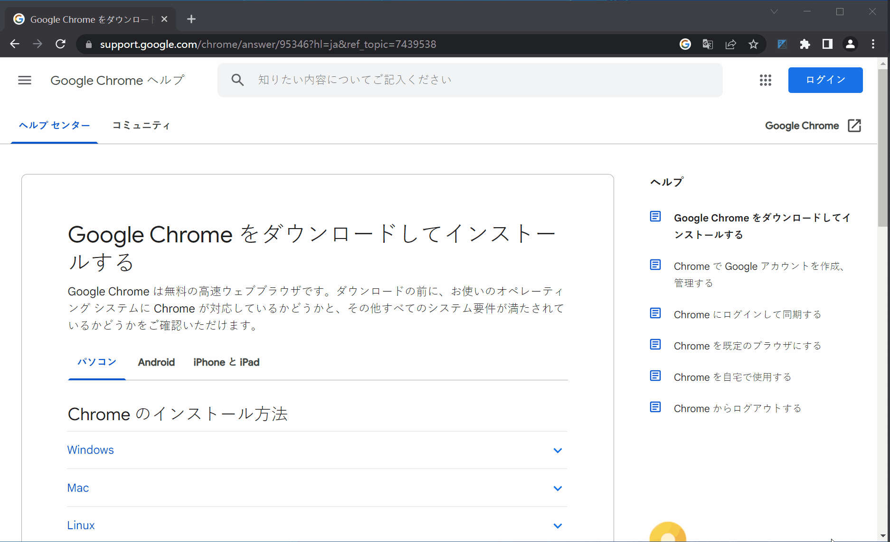
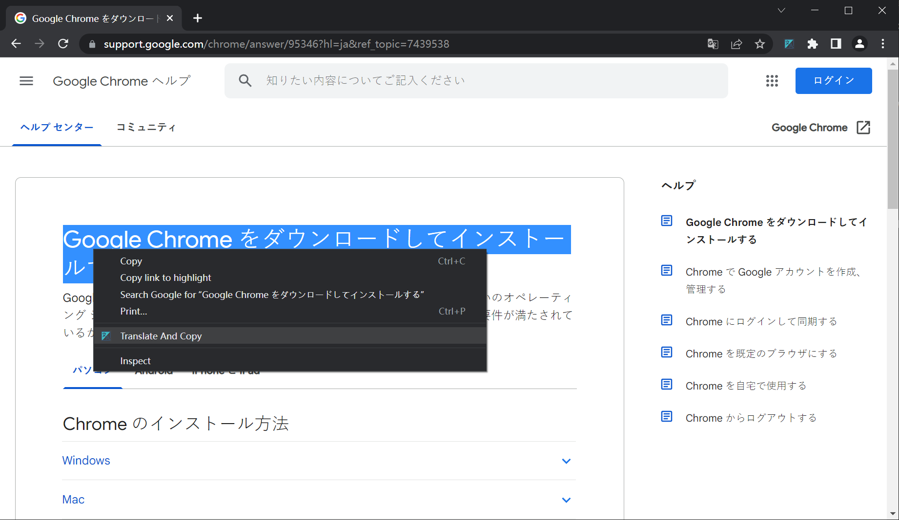
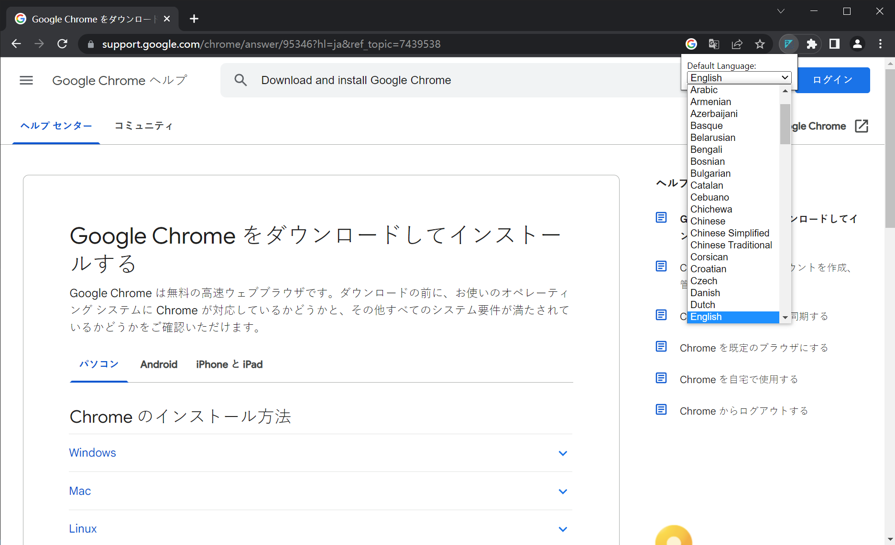

# Translate And Copy

Convert the selected text on the webpage to another language, and then copy it to the clipboard for easy pasting. The main purpose is to reply to messages in other languages, so we can only rely on machine translation.

Using

1. Select a piece of text
2. Right-click the menu to select `Translate And Copy` or press the shortcut key `Alt+T`
3. Paste the translated text

